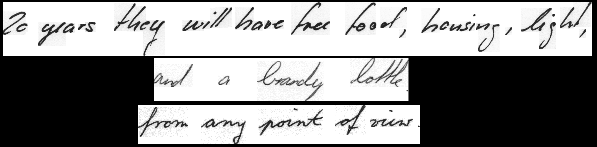

# [WIP] Research project within the scope of the master's thesis.

## Thesis
Investigation of the influence of architectural features of neural networks in the task of recognizing handwritten text without explicit segmentation on characters.

## Problem formulation
### Input
An image of a cut-out single-line handwritten text. Examples:

### Output
A recognized text from the input image.

### Training dataset
[IAM](https://fki.tic.heia-fr.ch/databases/iam-handwriting-database) with [IAM-B](https://github.com/shonenkov/IAM-Splitting) splitting.

### Training conditions
- Expand input with white pixels (32 for horizontal axis, 16 for vertical).
- Resize to the height=64 with keeping the aspect ratio.
- Other pre- and post-processing are disabled.
- Early stopping for 50 epochs without improvement on the validation.
- Adam optimizer with 5e-4 learning rate.
- Cross-entropy loss.
- Teacher rate is 0.8.

More hyperparameters can be found [here (add the link to cfg)]).

## Experiments results
Link?

## Conclusions

## Repo structure

## Requirements
git clone --recursive https://github.com/parlance/ctcdecode.git
https://github.com/parlance/ctcdecode
cd ctcdecode && pip install .
