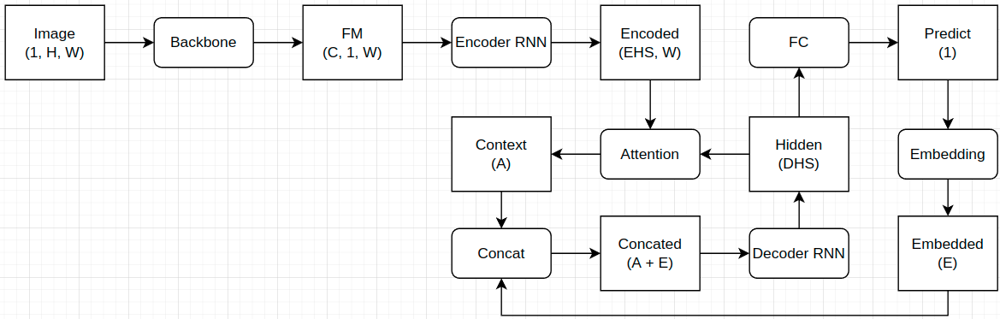
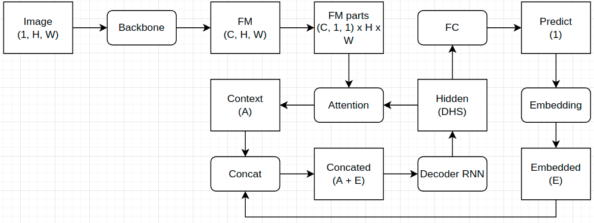
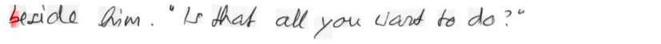

# [WIP] Research project within the scope of the master's thesis.
## Thesis
Investigation of the influence of architectural features of neural networks in the task of recognizing handwritten text without explicit segmentation on characters.

## Problem formulation
### Input
An image of a cut-out single-line handwritten text. Examples:


### Output
A recognized text from the input image.

### Training dataset
[IAM](https://fki.tic.heia-fr.ch/databases/iam-handwriting-database) with [IAM-B](https://github.com/shonenkov/IAM-Splitting) splitting.

### Training conditions
- No preatrained models.
- Expand input with white pixels (32 for horizontal axis, 16 for vertical).
- Resize to the height=64 with keeping the aspect ratio.
- Other pre- and post-processing are disabled.
- Early stopping for 50 epochs without improvement on the validation.
- Adam optimizer with 5e-4 learning rate.
- Cross-entropy loss.
- Teacher rate is 0.8.
- Early stopping after 50 epochs.
- Batch size is 32 (for models with Batch Normalization layers).

More hyperparameters can be found in config (.cfg) files (like [this](scripts/train.cfg)).

## General idea
Let's start from the baseline. It is typical seq2seq architecure with Bahdanau attention:


General hypothesis is that we can skip the `Encoder RNN` part and apply the attention directly on the features map from the backbone. So the proposed architecure will look like this:


It this works, then we could interpret attention maps as a segmentations maps for each decoded symbol. This will be also checked in this work.

Also some secondary hypotheses will be checked.

## Experiments
### Baseline
The backbone compresses image into a single line with shape (1 x W x 256) and consists of the following layers:
```
Conv 5x5, 32 channels   -> Batch Norm -> ReLU -> Max Pool 2x2
Conv 5x5, 64 channels   -> Batch Norm -> ReLU -> Max Pool 2x2
Conv 3x3, 128 channels  -> Batch Norm -> ReLU -> Max Pool 2x1
Conv 3x3, 128 channels  -> Batch Norm -> ReLU -> Max Pool 2x1
Conv 3x3, 256 channels  -> Batch Norm -> ReLU -> Max Pool 2x1
Conv 1x1, 256 channels  -> Batch Norm -> ReLU -> Max Pool 2x1
```

The baseline seq2seq achieved `16.211` CER on the test subset (experiment name is `2022-06-14_seq2seq`).

### Replacing encoder RNN with PositionalEncoder
The first experiment is very simple: let's just remove the encoder RNN. Attention is looking on the raw output from backbone. Model can't train - CER is `75.32` (experiment name is `2022-06-16_seq2seqL_seq2seq_no_enc`). It took into account embeddings only totally ignored the visual part.

To fix that let's assume that the encoder introduced a spatial information that was critical. To check this hypothesis the PositionalEncoder layer was added between the backbone and attention layers. The resulted CER is `21.511` (experiment name is `2022-06-13_seq2seqL_LN2BN`). Looks like PE adds some some spatial information which was removed with encoder RNN but can't fully compensate it.

Comparison table:
| Architecture   | Old       | New       | Impact   |
|----------------|-----------|-----------|----------|
| Parameters num | 1,782,936 | 1,387,672 | −395,264 |
| CER            | 16.211    | 21.511    | +5.3     |
| GPU (BS=24)    | 68 ms     | 50 ms     | −26.5%   |
| CPU (BS=24)    | 4141 ms   | 3673 ms   | −11.3%   |
| CPU (BS=1)     | 281 ms    | 201 ms    | −28.5%   |

### Normalization layer
To avoid dependence on the batch size the following experiment was carried out to replace BatchNorm with InstanceNorm (experiment name is `2022-06-13_seq2seqL_LN_5e-4`).

| Norm type      | BatchNorm | InstanceNorm | Impact |
|----------------|-----------|--------------|--------|
| Parameters num | 1,387,672 | 1,384,210    | −3,462 |
| CER            | 21.511    | 19.672       | −1.839 |
| GPU (BS=24)    | 50 ms     | 52 ms        | +4%    |
| CPU (BS=24)    | 3673 ms   | 4975 ms      | +35.4% |
| CPU (BS=1)     | 201 ms    | 248 ms       | +23.4% |

In view that the normalization switch led to quality improvement the same change was applied to the baseline (experiment name is `2022-06-23_seq2seq_BN2LN`).

| Norm type      | BatchNorm | InstanceNorm | Impact |
|----------------|-----------|--------------|--------|
| Parameters num | 1,782,936 | 1,779,474    | -3,462 |
| CER            | 16.211    | 14.768       | -1.443 |
| GPU (BS=24)    | 68 ms     | 71 ms        | +4.4%  |
| CPU (BS=24)    | 4141 ms   | 5286 ms      | +27.7% |
| CPU (BS=1)     | 281 ms    | 335 ms       | +19.2% |

In the end, the relative effect is the same (-8.5% and -8.9% CER) but the processing time increased. Most likely the InstanceNorm implementation that was used is not efficient enough.

### Recurrency layer
Another small change was testes - switch from LSTM to GRU, because the last one has less parameters (experiment name is `2022-06-13_seq2seqL_gru`).

| Recurrency type | LSTM      | GRU       | Impact   |
|-----------------|-----------|-----------|----------|
| Parameters num  | 1,384,210 | 1,236,242 | -147,968 |
| CER             | 19.672    | 20.994    | +1.322   |
| GPU (BS=24)     | 52 ms     | 63 ms     | +21.2%   |
| CPU (BS=24)     | 4975 ms   | 4832 ms   | -2.9%    |
| CPU (BS=1)      | 248 ms    | 256 ms    | +3.2%    |

GRU shows worse quality so will not applied to the future experiments.

### Gates
In view that the PositionalEncoder can't fully compensate the removed encoder RNN it is necessary to find a solution. The hypothesis is that some gating mechanism was also removed with the encoder. To test that a gating mechanism from [this paper](https://arxiv.org/abs/2012.04961) was added (experiment names `2022-06-14_seq2seqL_gate_1`, `2022-06-14_seq2seqL_gate_2` and `2022-06-14_seq2seqL_gate_3`).

| Blocks num     | 0         | 1         | 2         | 3         |
|----------------|-----------|-----------|-----------|-----------|
| Parameters num | 1,384,210 | 1,518,354 | 1,652,498 | 1,786,642 |
| Impact         |           | +134,144  | +268,288  | +402,432  |
|                |           |           |           |           |
| CER            | 19.672    | 15.799    | 18.388    | 18.776    |
| Impact         |           | -3.963    | -1.374    | -0.986    |
|                |           |           |           |           |
| GPU (BS=24)    | 52 ms     | 64 ms     | 66 ms     | 69 ms     |
| Impact         |           | +23.1%    | +26.9%    | +32.7%    |
|                |           |           |           |           |
| CPU (BS=24)    | 4975 ms   | 5076 ms   | 5317 ms   | 7237 ms   |
| Impact         |           | +2%       | +6.9%     | +45.5%    |
|                |           |           |           |           |
| CPU (BS=1)     | 248 ms    | 266 ms    | 278 ms    | 285 ms    |
| Impact         |           | +7.3%     | +12.1%    | +14.9%    |

Best performance was achieved with a single gating block. This model has less parameters and works faster than the baseline but has a bit worse quality (`15.799` vs `14.768`).

### Replacing regular convolution with depthwise separable convolution
Another interesting trick from the [paper](https://arxiv.org/abs/2012.04961) is to use the depthwise separable convolution instead of regular convolution. To test effect of this all convolutions in the backbone were changed to DSC with different `k` parameter (experiment names `2022-06-16_seq2seqL_dsc_k1`, `2022-06-16_seq2seqL_dsc_k2`, `2022-06-15-seq2seqL_dsc_k3` and `2022-06-15-seq2seqL_dsc_k4`).

Comparison with `2022-06-14_seq2seqL_gate_1` model from the previous paragraph:
| k              | 1         | 2         | 3         | 4         |
|----------------|-----------|-----------|-----------|-----------|
| Parameters num | 1,014,252 | 1,143,782 | 1,273,312 | 1,402,842 |
| Impact         | -504,102  | -374,572  | -245,042  | -115,512  |
|                |           |           |           |           |
| CER            | 21.304    | 18.773    | 17.579    | 17.869    |
| Impact         | +5.505    | +2.974    | +1.78     | +2.07     |
|                |           |           |           |           |
| GPU (BS=24)    | 67 ms     | 68 ms     | 68 ms     | 69 ms     |
| Impact         | +4.7%     | +6.2%     | +6.2%     | +7.8%     |
|                |           |           |           |           |
| CPU (BS=24)    | 5468 ms   | 6225 ms   | 6684 ms   | 7380 ms   |
| Impact         | +7.7%     | +22.6%    | +31.7%    | +45.4%    |
|                |           |           |           |           |
| CPU (BS=1)     | 231 ms    | 263 ms    | 278 ms    | 289 ms    |
| Impact         | -13.2%    | -1.1%     | +4.5%     | +8.6%     |

The quality decreased but also the number of parameters decreased too. This could be useful for embedded devices.

### Increasing the backbone output size
Since the removed encoder contained a lot of parameters as a possible improvement could be to add removed parameters to adjacent layers. For this purpose the output size of the backbone was increased from 256 to 384 (experiment name `2022-06-14_seq2seqL_bb_384`).

| Output size    | 256       | 384                  |
|----------------|-----------|----------------------|
| Parameters num | 1,518,354 | 1,880,466 (+362,112) |
| CER            | 15.799    | 15.361 (-0.438)      |

A small quality improvement with a large increase in the number of parameters.

### Increasing the attention hidden size
The same logic was applied to the attention layer (experiment names `2022-06-14_seq2seqL_attn_384`, `2022-06-14_seq2seqL_attn_512` and `2022-06-18_seq2seqL_attn_192`).

| Attention size | 192                 | 256       | 384                 | 512                  |
|----------------|---------------------|-----------|---------------------|----------------------|
| Parameters num | 1,485,394 (-32,960) | 1,518,354 | 1,584,274 (+65,920) | 1,650,194 (+131,840) |
| CER            | 16.557 (+0.758)     | 15.799    | 16.113 (+0.314)     | 16.228 (+0.429)      |

### 2D attention
To test the hypothesis that the network can learn character segmentation without segmentation markup the architecure should be changed. Previously the attention layer was applied to 1D features map from the backbone. To increase the resolution of the attention the kernel sizes for some pooling layers were decreased to get the height 4 and 8 pixels (experiment names `2022-06-14_seq2seqL_gate_1_expand_h` and `2022-06-15_seq2seqL_expand_h_8` respectively). Additional experiment with height=8 is based on height=4 but the input height was increased from 64 to 128 (experiment name `2022-06-15_seq2seqL_expand_h_128`).

| Feature map height | 1       | 4        | 8        | 8 (128)       |
|--------------------|---------|----------|----------|---------------|
| CER                | 15.799  | 15.399   | 14.839   | 15.224        |
| Impact             |         | -0.4     | -0.906   | -0.575        |
|                    |         |          |          |               |
| GPU (BS=24)        | 64 ms   | 68 ms    | 81 ms    | 86 ms (BS=14) |
| Impact             |         | +6.2%    | +26.6%   | +34.4%        |
|                    |         |          |          |               |
| CPU (BS=24)        | 5076 ms | 13928 ms | 23519 ms | 42718 ms      |
| Impact             |         | +174.4%  | +363.3%  | +741.6%       |
|                    |         |          |          |               |
| CPU (BS=1)         | 266 ms  | 346 ms   | 486 ms   | 1014 ms       |
| Impact             |         | +30.1%   | +82.7%   | +281.2%       |

The results show that this approach improves CER but with high cost in performance.

#### 2D attention maps
Nonetheless, this experiment is also interesting because attention maps.

|                 |
|------------------------------------------------------------|
|Decoded text: for a man who had been seen leaving the train |

|                 |
|------------------------------------------------------------|
|Decoded text: for a man who had been seen leaving the train |

|                    |
|---------------------------------------------------------------|
|Decoded text: reuaned a mystery until later tne following day, |

|             |
|--------------------------------------------------------|
|Decoded text: beside Gim. "Is that all you vand to do?" |

|       |
|--------------------------------------------------|
|Decoded text: Poc gave her hand a shake. "Wake up |


## Experiments results
[Google Sheet](https://docs.google.com/spreadsheets/d/1lyGR1rrdM_5rV6hFVAG-l_qH5hY_nFo-RYbRMune5wY/edit?usp=sharing)


## Conclusions


## Full text
At the moment, the full text of the dissertation is available only in Russian (by [this](https://drive.google.com/file/d/1j2pHa8LQBd930r8wSNea7oac5xRiwgHQ/view?usp=sharing) link).

## Requirements
All requirements can be found in [requirements.txt](requirements.txt).

## Usage
Better to run training from the `scripts/` directory. Otherwise change paths to dataset in config files (or don't use them).

To train a CTC baseline use the following command:
```bash
./train.py --config ./train.cfg --model-type baseline baseline-args --config-baseline ./baseline.cfg
```

To train a seq2seq baseline use the following command:
```bash
./train.py --config ./train.cfg --model-type seq2seq seq2seq-args --config-seq2seq ./seq2seq.cfg
```

To train a modified seq2seq with 2D attention use the following command:
```bash
./train.py --config ./train.cfg --model-type seq2seq-light seq2seq-args --config-seq2seq ./seq2seq_light.cfg
```

## Repo structure


## Gratitude
I want to express my gratitude to the people who helped and inspired me at work, namely:
- Andrey Kuroptev - for sensitive and high-quality scientific guidance;
- Andrey Upshinsky - for valuable consultation;
- Maria Eidlina - for invaluable support in experimental activities;
- Maria Yarova - for useful discussions and critical point of view.
